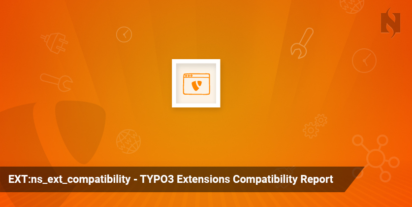


.. include:: ../Includes.txt

===================
General Information
===================

EXT:ns_ext_compatibility
=========================

.. _What-does-it-do:

What does it do?
================

TYPO3 community continuously releases major LTS (Long-term support) version of TYPO3 eg., 7.x, 8.x, 9.x. In this case, TYPO3 Agencies, Integrators, Developers and Owners face the challenge of upgrading their existing LTS versions to the new LTS versions. This extension supports to check feasibility and complexity to define a perfect workflow to upgrade next TYPO3 version. Just install and select your target TYPO3 version and use following good features to analyze estimation and define project flow:

- TYPO3 System overview report
- Extensions Statistics
- Server Compatibility for your target TYPO3 version
- TYPO3 Extensions Compatibility Report
- Automatic email notification of new update of TYPO3 core and extensions
- Compatibiltiy from TYPO3 4.x to 8.x

Note:
It is important to understand that this extension does not modify, update or replace any existing extensions or fix any PHP code. The purpose of this extension is to generate a report about installed extension compatibility with newly released TYPO3 LTS version.

.. _Screen-shots:

Screen Shots
================

	.. figure:: Images/TYPO3_ns_ext_compatibility_Screenshot_1.png
	   :alt: screenshot "TYPO3_ns_ext_compatibility_Screenshot_1"
	   :class: with-shadow
	   :width: 1300px

	.. figure:: Images/TYPO3_ns_ext_compatibility_Screenshot_2.png
	   :alt: screenshot "TYPO3_ns_ext_compatibility_Screenshot_1"
	   :class: with-shadow
	   :width: 1300px

	.. figure:: Images/TYPO3_ns_ext_compatibility_Screenshot_3.png
	   :alt: screenshot "TYPO3_ns_ext_compatibility_Screenshot_3"
	   :class: with-shadow
	   :width: 1300px